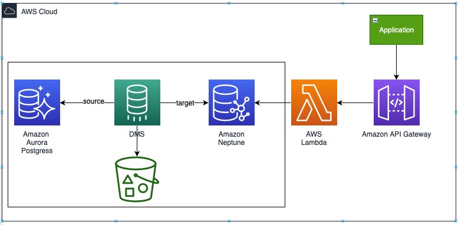

# AWS Neptune Mortgage Backed Security data model


As organizations adopt modern application architectures such as microservices, application teams tend to retrofit one-size-fits-all databases. Mortgage industry is going through unprecedented transformation due to changing generation technologies such as API adoption. In the mortgage industry, API-enabled software allows lenders, issuers to integrate different functionalities into their portal, meaning they bring together data  that were previously siloed.

Mortgage-backed securities (MBS), are bonds secured by home and other real estate loans. They are created when several loans, usually with similar characteristics, are pooled together under a legal entity. Most mortgage-backed securities are issued by the Government National Mortgage Association, a U.S. government agency, or the Federal National Mortgage Association and the Federal Home Loan Mortgage Corporation, U.S. government-sponsored enterprises. 

In this article we have addressed the use-case of modeling the mortgage-backed security data using purpose-built database such as Amazon Neptune. By migrating the data to Amazon Neptune, we can dismantle barriers between data sources via a knowledge graph approach which can provide a basis for better risk modeling and data consumption by means of several APIs.

Today, in mortgage-backed securities (MBS), there is a need to provide a holistic view of loan, borrower, property, pool, security, servicer, originator and many such as related entities in a highly-connected manner. The securities model is typically hierarchal in nature with group of entities such as loans, pool (pool of loans), securities (‘n’ levels), etc. which brings the complexity of modeling the entity model rather difficult in a traditional database data store. Moreover, adding any new entity to existing model typically requires changes in the data that's already setup. This blog goes through the process of unloading the source data from an existing relational data store, building the knowledge graph model and consumption of the same.


## Solution overview

The following diagram shows the solution architecture.



The solution comprises:

1. Amazon API (Application Programming Interface)  Gateway – a fully managed service that makes it easier to create, publish, maintain, monitor, and secure APIs at any scale for API consumers. API Gateway helps you manage traffic to backend systems, translation of input request into a graph language specific query and returns the output in more readable manner for the consumer API Gateway uses AWS Lambda as the proxy for the service implementation,
2. AWS (Amazon Web Services) Lambda – a serverless execution environment giving you an ability to interact with the Amazon Neptune using gremlin query interface. The AWS Lambda provides the query function of underlying connected data using a REST interface. We will also use AWS lambda to load sample MBS source datasets into Amazon Aurora PostgreSQL.
3. Amazon RDS (Relational Database Service) is a managed relational database service for MySQL, PostgreSQL, MariaDB, Oracle BYOL, or SQL Server. Amazon Aurora PostgreSQL is a fully managed, PostgreSQL–compatible, and ACID ( atomicity, consistency, isolation and durability) compliant relational database engine that combines the speed, reliability, and manageability of Amazon Aurora with the simplicity and cost-effectiveness of open-source databases.  We will show how the entities are modeled is using Amazon Aurora PostgreSQL where our source data resides.
4. Amazon Neptune -  fast, reliable, fully managed graph database service that makes it easy to build and run applications. We will show how the knowledge graph is built from our source data. Amazon Neptune will be our target data store.
5. AWS DMS (Data Migration Service) - helps us to migrate the data from source database (Amazon Aurora PostgreSQL) to target database (Amazon Neptune) quickly and securely. We will walk through the steps in building the mapping files needed for the migration.
6. Amazon Simple Storage Service (Amazon S3) is an object storage service offering industry-leading scalability, data availability, security, and performance.  We use Amazon S3 for staging the source data sets and for the AWS DMS migration task.


## Prerequisites
- [Python](https://www.python.org/downloads/release/python-390/) version 3.9.
- [Docker](https://docs.docker.com/desktop/) version 20.10.12¬¬
- [Postman](https://www.postman.com/downloads/) to test your API.
- Set up [AWS CLI](https://aws.amazon.com/cli/) to allow you to deploy your resources.
- Have the appropriate AWS credentials for interacting with resources in your AWS account.
- Install [CDK](https://aws.amazon.com/getting-started/guides/setup-cdk/module-two/) v2

## Solution walkthrough

1. Clone the project GitHub repository to your local machine after completing the prerequisites 
```
git clone git@ssh.gitlab.aws.dev:vkpaws-scsaws/mbs-modeling-in-neptune.git
```

2. Change directory to mbs-modeling-in-neptune
```
cd mbs-modeling-in-neptune
```

3. Login to AWS account (AWS CLI) where you want to deploy the CDK stack resources

4. Create a virtual environment on MacOS / Linux and activate the same.
```
python3 -m venv .venv

source .venv/bin/activate

(OR)

.venv\Scripts\activate.bat
```

5. Install the python dependent packages
```
pip install -r requirements.txt
```

6. Execute the following commands to bootstrap AWS environment
```
#get account number using below command
aws sts get-caller-identity --query Account --output text

#set region using below command
aws configure set region us-east-1

#Bootstrap AWS environment. Replace ACCOUNT-NUMBER with value
#retrieved from above commands
cdk bootstrap aws://<ACCOUNT-NUMBER>/us-east-1
```

7. Reminder: verify if Docker daemon is running

8. Deploy the CDK project ( this process could take time more or less 30 minutes )
```
cdk deploy --all --require-approval never
```


## Cleaning up

To avoid incurring ongoing charges, clean up the infrastructure by executing the following :

```
cdk destroy —all —require-approval never
```


## Security

See [CONTRIBUTING](CONTRIBUTING.md#security-issue-notifications) for more information.

## License

This library is licensed under the MIT-0 License. See the LICENSE file.


